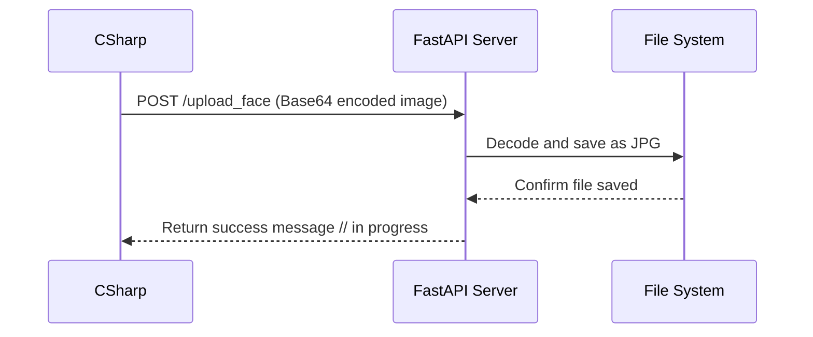

# FastAPI_C-MAUI Integration

A **cross-platform demo project** showcasing communication between **C# MAUI (Frontend)** and **Python FastAPI (Backend)**.

---

## Overview

### Module 01 – Mathematical Operations  
Perform basic math operations through a modern C# MAUI interface:  
- Input four numbers  
- Select an operation (Addition, Subtraction, Multiplication, Division, etc.)  
- Send data to a FastAPI backend  
- Receive and display the computed result in real time  

### Module 02 – Image Data Bridge  
A seamless bridge for **image transmission** between MAUI and FastAPI:  
1. Capture or select an image from the MAUI app  
2. Encode it to **Base64** in C#  
3. Send the encoded data to the FastAPI server  
4. Decode and **save the image file** for processing (e.g., Face Recognition, Machine Learning, etc.)  
---

## 🧩 Example Flow (Module 02)

## Use Cases
- Face authentication / recognition  
- Data serialization between cross-platform systems  
- Demonstration of image I/O interoperability  
---

